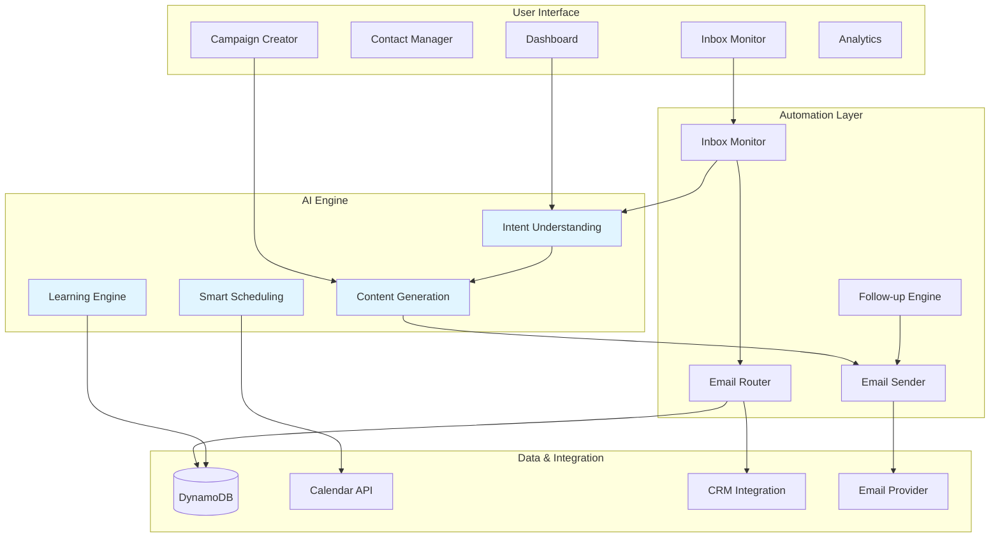

# Interon AI Email Agent 🤖📧

> **Your Intelligent Email Assistant** - Automates email outreach, monitors inbox, understands intent, and responds like a human

[](https://aws.amazon.com)
[](https://reactjs.org)
[](https://python.org)
[](https://anthropic.com)

## 🚀 What is Interon AI Email Agent?

Imagine having a **personal email assistant** that:
- 📤 **Sends thousands of personalized emails** based on just your intent
- 📥 **Monitors your inbox** for new emails, threads, and priority senders
- 🧠 **Understands context** - sales, support, scheduling, follow-ups
- ✍️ **Writes human-like responses** that match your tone and style
- ⏱️ **Schedules and follows up** automatically when there's no response
- 🏷️ **Organizes everything** - labels, routes to CRM, updates calendar
- 📊 **Learns from you** - gets better with every edit and interaction

**That's Interon AI Email Agent** - your AI-powered email workforce.

---

## 💡 The Problem We Solve

### Traditional Email Challenges:

❌ **Manual Outreach is Slow**
- Writing 100 personalized emails takes hours
- Copy-paste feels robotic and gets ignored
- Tracking responses is a nightmare

❌ **Inbox Overwhelm**
- Hundreds of emails daily
- Important messages get buried
- Response time suffers

❌ **Repetitive Tasks**
- Same questions answered repeatedly
- Follow-ups forgotten
- Calendar scheduling back-and-forth

❌ **Context Switching**
- Jump between email, CRM, calendar
- Lose track of conversations
- Miss opportunities

### Our Solution:

✅ **AI-Powered Automation**
- Write your intent → AI generates thousands of personalized emails
- Sends to massive recipient lists automatically
- Tracks everything in real-time

✅ **Intelligent Inbox Management**
- Monitors inbox 24/7
- Understands email intent (sales, support, scheduling)
- Prioritizes what matters

✅ **Human-Like Responses**
- AI writes context-aware replies
- Matches your tone and style
- Includes relevant details automatically

✅ **Smart Follow-Ups**
- Automatically nudges non-responders
- Schedules meetings without back-and-forth
- Never lets opportunities slip

✅ **Seamless Integration**
- Auto-labels and routes emails
- Updates CRM automatically
- Syncs with calendar for events/holidays
- Learns from your feedback

---

## 🎯 How It Works

### 1️⃣ **Outbound Campaigns** - Send at Scale

**You**: "I want to reach out to 10,000 job candidates about our internship program"

**AI Agent**:
- 🎨 Generates personalized email variations
- 📅 Checks calendar for holidays/special dates
- 🎯 Sends to all recipients with perfect timing
- 📊 Tracks opens, clicks, and responses
- 🔄 Automatically follows up with non-responders

**Result**: 10,000 personalized emails sent in minutes, not weeks.

---

### 2️⃣ **Inbox Monitoring** - Never Miss Important Emails

**AI Agent Monitors**:
- 📥 New emails arriving
- 💬 Ongoing threads
- ⭐ Priority senders (VIPs, clients, team)
- 🔔 Urgent keywords ("urgent", "ASAP", "deadline")

**What It Does**:
- 🏷️ Auto-labels: Sales, Support, Scheduling, Follow-up
- 📌 Flags high-priority messages
- 🔄 Routes to appropriate team/system
- 📊 Surfaces insights and trends

---

### 3️⃣ **Intent Understanding** - Knows What People Want

**AI Analyzes Every Email**:

🛍️ **Sales Inquiry**
- "I'm interested in your product..."
- → Routes to sales team
- → Generates product info response
- → Schedules demo automatically

🆘 **Support Request**
- "I'm having trouble with..."
- → Creates support ticket
- → Sends troubleshooting steps
- → Escalates if needed

📅 **Meeting Request**
- "Can we schedule a call?"
- → Checks your calendar
- → Proposes available times
- → Sends calendar invite

🔄 **Follow-Up**
- "Following up on my previous email..."
- → Finds original thread
- → Generates contextual response
- → Updates status

---

### 4️⃣ **AI-Generated Responses** - Writes Like You

**Example 1: Sales Inquiry**

**Incoming Email**:
> "Hi, I saw your product and I'm interested in learning more for my team of 50 people."

**AI Response** (Generated in seconds):
> "Hi [Name],
> 
> Thanks for reaching out! I'd love to show you how [Product] can help your team of 50.
> 
> Based on your team size, I recommend our Enterprise plan which includes:
> - Unlimited users
> - Priority support
> - Custom integrations
> 
> I have availability this Thursday at 2 PM or Friday at 10 AM for a 30-minute demo. Which works better for you?
> 
> Looking forward to connecting!
> 
> Best,
> [Your Name]"

**Features**:
- ✅ Personalized with recipient's details
- ✅ Contextual (mentions team size)
- ✅ Actionable (proposes specific times)
- ✅ Professional yet friendly tone

---

**Example 2: Support Request**

**Incoming Email**:
> "I can't log into my account. It says 'invalid password' but I'm sure it's correct."

**AI Response**:
> "Hi [Name],
> 
> Sorry to hear you're having trouble logging in! Let's get this sorted out quickly.
> 
> Here are a few things to try:
> 1. Use the 'Forgot Password' link to reset your password
> 2. Clear your browser cache and cookies
> 3. Try a different browser or incognito mode
> 
> If none of these work, I've created a support ticket (#12345) and our team will reach out within 1 hour.
> 
> In the meantime, you can also try our mobile app as an alternative.
> 
> Let me know if you need anything else!
> 
> Best,
> Support Team"

**Features**:
- ✅ Empathetic opening
- ✅ Step-by-step troubleshooting
- ✅ Ticket created automatically
- ✅ Alternative solution offered

---

### 5️⃣ **Smart Scheduling** - No More Back-and-Forth

**Traditional Way** (5+ emails):
```
Them: "Can we meet next week?"
You: "Sure! What day works?"
Them: "Tuesday or Wednesday"
You: "Tuesday at 2pm?"
Them: "2pm doesn't work, how about 3pm?"
You: "3pm works! I'll send a calendar invite"
```

**AI Agent Way** (1 email):
```
AI: "Hi! I'd love to meet next week. 

Based on your calendar, here are my available times:
- Tuesday, Jan 7 at 10 AM, 2 PM, or 4 PM
- Wednesday, Jan 8 at 11 AM or 3 PM

Click your preferred time and I'll send a calendar invite:
[Book Tuesday 10 AM] [Book Tuesday 2 PM] [Book Tuesday 4 PM]
[Book Wednesday 11 AM] [Book Wednesday 3 PM]

Looking forward to it!"
```

**Result**: Meeting scheduled in 1 email instead of 5.

---

### 6️⃣ **Automatic Follow-Ups** - Never Let Opportunities Slip

**Scenario**: You sent a proposal to 50 potential clients

**AI Agent**:
- ⏰ **Day 3**: No response → Sends friendly nudge
  - "Just wanted to make sure you received my proposal..."
  
- ⏰ **Day 7**: Still no response → Sends value reminder
  - "Quick question - is there anything I can clarify about the proposal?"
  
- ⏰ **Day 14**: Final follow-up
  - "I understand you might be busy. Should I follow up next month?"

**Smart Features**:
- 🎯 Only follows up with non-responders
- 📅 Respects holidays and weekends
- 🔄 Stops if they reply
- 📊 Tracks engagement for each contact

---

### 7️⃣ **Calendar Integration** - Context-Aware Timing

**AI Knows**:
- 🎄 **Holidays**: "Merry Christmas! Hope you're enjoying the holidays..."
- 🎂 **Birthdays**: "Happy Birthday! Wishing you an amazing year ahead..."
- 📅 **Anniversaries**: "Congrats on 5 years with the company!"
- 🏖️ **Out of Office**: Delays sends until they're back
- 🌍 **Time Zones**: Sends at optimal time for each recipient

**Example**:
- You schedule a campaign for Monday
- AI detects Monday is a holiday in recipient's country
- Automatically reschedules for Tuesday
- Adds holiday greeting to email

---

### 8️⃣ **Learning & Improvement** - Gets Smarter Over Time

**AI Learns From**:

📝 **Your Edits**
- You edit an AI-generated response
- AI learns your preferred phrasing
- Future responses match your style better

✅ **Successful Outcomes**
- Email gets positive response
- AI notes what worked
- Replicates success in similar situations

❌ **Unsuccessful Outcomes**
- Email ignored or negative response
- AI adjusts approach
- Tries different tone/content next time

🎯 **Feedback Signals**
- Which subject lines get opened
- Which CTAs get clicked
- Which follow-up timing works best

**Result**: Your AI assistant becomes more "you" over time.

---

## ✨ Key Features

### 📤 **Mass Outreach**
- Send to thousands of recipients with one click
- AI generates unique variations for each person
- Personalization beyond just {{firstName}}
- Real-time delivery tracking

### 📥 **Inbox Monitoring**
- 24/7 monitoring of incoming emails
- Priority detection (VIP senders, urgent keywords)
- Thread tracking and conversation history
- Smart notifications for important messages

### 🧠 **Intent Recognition**
- Automatically categorizes: Sales, Support, Scheduling, Follow-up
- Understands context from email content
- Detects urgency and sentiment
- Routes to appropriate handler

### ✍️ **Human-Like Writing**
- Context-aware responses
- Matches your tone and style
- Includes relevant details automatically
- Professional yet personable

### ⏱️ **Smart Scheduling**
- Calendar integration
- Proposes available times automatically
- Handles time zones
- Sends calendar invites

### 🔄 **Automatic Follow-Ups**
- Configurable timing (3 days, 7 days, etc.)
- Stops when recipient responds
- Respects holidays and weekends
- Personalized nudges

### 🏷️ **Organization & Routing**
- Auto-labels emails
- Routes to CRM/ticketing systems
- Updates contact records
- Syncs with calendar

### 📊 **Analytics & Learning**
- Track open rates, click rates, response rates
- Identify what works
- Continuous improvement
- Performance insights

### ✅ **Compliance**
- GDPR, CAN-SPAM, CASL compliant
- Unsubscribe handling
- Content moderation
- Audit trails

---

## 🎯 Real-World Examples

### Example 1: Recruitment Campaign

**Your Intent**: "Reach out to 5,000 software engineers about our job openings"

**AI Agent Does**:
1. 🎨 Generates 5 email variations with different angles
2. 📅 Checks calendar - avoids sending on Thanksgiving
3. 🌍 Adjusts timing for different time zones
4. 📤 Sends 5,000 personalized emails
5. 📊 Tracks who opens, clicks, applies
6. 🔄 Follows up with engaged candidates after 3 days
7. 📅 Schedules interviews automatically

**Result**: 500 applications, 50 interviews scheduled, 10 hires - all automated.

---

### Example 2: Customer Support

**Scenario**: 200 support emails arrive daily

**AI Agent**:
1. 📥 Monitors inbox continuously
2. 🏷️ Auto-labels: Bug Report, Feature Request, How-To Question
3. 🆘 Flags urgent issues (system down, payment failed)
4. ✍️ Generates responses for common questions
5. 🎫 Creates tickets for complex issues
6. 📊 Routes to appropriate team member
7. 🔄 Follows up if issue not resolved in 24 hours

**Result**: 80% of emails handled automatically, 20% escalated to humans, 95% customer satisfaction.

---

### Example 3: Sales Follow-Up

**Scenario**: You met 100 people at a conference

**AI Agent**:
1. 📤 Sends personalized "nice to meet you" emails to all 100
2. 📊 Tracks who responds
3. 🔄 Day 3: Follows up with non-responders
4. 📅 Schedules demos with interested prospects
5. 🏷️ Tags contacts by interest level
6. 📈 Updates CRM with all interactions
7. 🔔 Alerts you when hot leads respond

**Result**: 40 demos scheduled, 15 deals in pipeline, zero manual work.

---

## 🛠️ Tech Stack

### Frontend
- **Framework**: React 18.3 with TypeScript
- **Build Tool**: Vite
- **UI**: Custom components with Lucide icons
- **State**: React Context API
- **Styling**: Tailwind CSS

### Backend
- **Runtime**: AWS Lambda (Python 3.9 & 3.11)
- **AI**: AWS Bedrock (Claude 3.5 Sonnet)
- **Database**: Amazon DynamoDB
- **Email**: Zoho Mail API
- **Storage**: Amazon S3

### AI Capabilities
- **Natural Language Understanding**: Intent classification, sentiment analysis
- **Content Generation**: Email composition, subject lines, follow-ups
- **Personalization**: Dynamic content based on recipient data
- **Learning**: Continuous improvement from feedback

---

## 📐 Architecture



---

## 🚀 Getting Started

### Quick Start

```bash
# Clone repository
git clone https://github.com/kamishas/Email-AI-Automation-Agent.git

# Install dependencies
npm install

# Start development server
npm run dev
```

Visit `http://localhost:5173` to see the application.

---

## 📚 Usage Guide

### 1. Create a Campaign

```
1. Go to Dashboard → New Campaign
2. Enter your intent: "Reach out to potential customers about our new product"
3. Select recipients (by tag or search)
4. AI generates email variations
5. Review and approve
6. Click Send
```

### 2. Monitor Inbox

```
1. Go to Inbox Monitor
2. See all incoming emails categorized by intent
3. Review AI-generated responses
4. Edit if needed or approve
5. AI sends and learns from your edits
```

### 3. Set Up Follow-Ups

```
1. In Campaign settings
2. Enable "Auto Follow-Up"
3. Set timing: 3 days, 7 days, 14 days
4. AI handles the rest automatically
```

---

## 🎯 Roadmap

### Coming Soon
- [ ] Gmail/Outlook direct integration
- [ ] Voice-to-email (speak your intent)
- [ ] Multi-language support (50+ languages)
- [ ] Advanced A/B testing
- [ ] Sentiment analysis dashboard
- [ ] Mobile app (iOS/Android)

---

## 📄 License

Proprietary - Interon AI

---

## 🆘 Support

**Live Demo**: https://interon-email-agent-frontend-kamin.s3.us-east-2.amazonaws.com/index.html

**Documentation**: See `/docs` folder

**Contact**: support@interon.ai

---

**Built with ❤️ by Interon AI Team**  
*Making email intelligent, one message at a time*