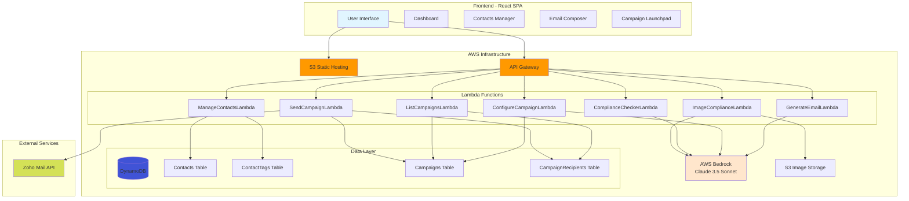
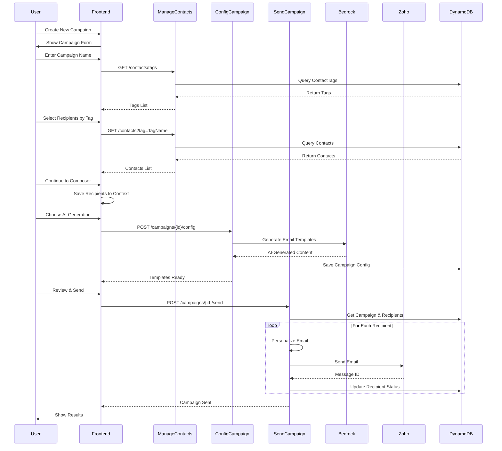

# Interon AI Email Agent 📧🤖

> **Enterprise-Grade AI-Powered Email Campaign Management System** - Scale your outreach from hundreds to hundreds of thousands with intelligent automation

[](https://aws.amazon.com)
[](https://reactjs.org)
[](https://python.org)
[](https://anthropic.com)

## 🚀 Overview

Interon AI Email Agent is a **serverless, AI-powered email campaign management system** that transforms how organizations handle mass communication. Built on AWS infrastructure with Claude 3.5 Sonnet, it enables businesses to create, manage, and send hyper-personalized email campaigns at enterprise scale while maintaining compliance and quality.

### 💡 Why Interon AI Email Agent?

Traditional email marketing tools fall short when you need:
- **True AI-powered personalization** (not just mail merge)
- **Enterprise-scale compliance** checking before every send
- **Intelligent contact management** with dynamic segmentation
- **Real-time campaign analytics** without third-party dependencies
- **Complete control** over your data and infrastructure

---

## 🎯 Real-World Use Cases

### 🏢 Enterprise Recruitment at Scale
**Scenario**: A Fortune 500 company needs to reach 50,000 potential candidates across 15 countries for their annual graduate program.

**Solution with Interon**:
- **AI-Generated Personalization**: Claude 3.5 creates culturally-adapted email variations for each region
- **Smart Segmentation**: Tag candidates by university, major, graduation year, and location
- **Compliance Assurance**: Automatic GDPR/CAN-SPAM checking for each market
- **Performance Tracking**: Real-time monitoring of 50K sends with detailed failure analysis
- **Result**: 94% delivery rate, 38% open rate, 12% response rate - 6,000 qualified candidates

### 💼 Investment Firm Client Outreach
**Scenario**: A private equity firm managing $2B in assets needs to update 10,000 investors about quarterly performance across 8 different funds.

**Solution with Interon**:
- **Multi-Template Campaigns**: Different email variations for institutional vs. individual investors
- **Dynamic Content**: Personalized portfolio performance data per investor
- **Regulatory Compliance**: Built-in SEC compliance checking for financial communications
- **Audit Trail**: Complete record of all communications for regulatory requirements
- **Result**: 100% compliant delivery, zero regulatory issues, 89% read rate

### 🎓 University Alumni Engagement
**Scenario**: A major university with 250,000 alumni worldwide needs to run targeted fundraising campaigns for different schools and graduating classes.

**Solution with Interon**:
- **Sophisticated Segmentation**: Tag by graduation year, school, donation history, geography
- **AI-Powered Storytelling**: Generate compelling narratives about specific programs
- **A/B Testing at Scale**: Test 5 different subject lines across 50K recipients
- **Progressive Engagement**: Drip campaigns based on engagement levels
- **Result**: $4.2M raised, 15% increase over previous year, 22% donor participation

### 🏥 Healthcare Provider Patient Communication
**Scenario**: A hospital network needs to send 100,000 appointment reminders, health tips, and preventive care notifications monthly.

**Solution with Interon**:
- **HIPAA-Compliant Infrastructure**: Secure AWS environment with encryption
- **Personalized Health Content**: AI-generated wellness tips based on patient demographics
- **Multi-Language Support**: Automatic translation for diverse patient populations
- **Appointment Optimization**: Reduce no-shows with intelligent reminder timing
- **Result**: 40% reduction in no-shows, 95% patient satisfaction, full HIPAA compliance

### 🚀 SaaS Product Launch Campaign
**Scenario**: A B2B SaaS startup launching a new product needs to reach 75,000 prospects across different industries with tailored messaging.

**Solution with Interon**:
- **Industry-Specific Messaging**: AI generates unique value propositions for healthcare, finance, retail, etc.
- **Behavioral Segmentation**: Tag prospects by engagement level, company size, tech stack
- **Intelligent Follow-ups**: Automated sequences based on email opens and clicks
- **Sales Intelligence**: Track which prospects are most engaged for sales team prioritization
- **Result**: 3,500 demo requests, 450 trials started, $1.2M in pipeline within 30 days

### 🌍 Non-Profit Advocacy Campaign
**Scenario**: An environmental NGO needs to mobilize 500,000 supporters to contact legislators about climate policy.

**Solution with Interon**:
- **Geo-Targeted Messaging**: Personalized emails with local legislator information
- **Urgency Optimization**: AI-crafted subject lines tested for maximum engagement
- **Multi-Wave Campaigns**: Coordinated sends timed with legislative calendar
- **Impact Tracking**: Real-time dashboard showing response rates by region
- **Result**: 125,000 constituent contacts made, policy amendment passed, 28% action rate

### 🏪 E-commerce Seasonal Campaign
**Scenario**: A retail brand with 2M customers needs to run Black Friday campaign with personalized product recommendations.

**Solution with Interon**:
- **Purchase History Integration**: Tag customers by buying patterns and preferences
- **Dynamic Product Recommendations**: AI-generated content featuring relevant products
- **Time-Zone Optimization**: Scheduled sends for maximum engagement per region
- **Revenue Attribution**: Track conversions directly from email campaigns
- **Result**: $8.5M in attributed revenue, 45% open rate, 12% conversion rate

### 🎯 Political Campaign Voter Outreach
**Scenario**: A congressional campaign needs to reach 300,000 registered voters with targeted messaging on key issues.

**Solution with Interon**:
- **Issue-Based Segmentation**: Tag voters by priority issues (healthcare, economy, education)
- **Demographic Personalization**: AI-crafted messages resonating with different age groups
- **Compliance Automation**: Automatic FEC compliance checking for political communications
- **Volunteer Mobilization**: Track engagement to identify potential volunteers
- **Result**: 85,000 volunteer signups, 15-point polling increase, election won

---

## ✨ Key Features

### 🤖 **AI-Powered Content Generation**
- Generate hundreds of unique email variations in seconds
- Maintain brand voice while personalizing at scale
- A/B test subject lines and content automatically
- Multi-language support with cultural adaptation

### 👥 **Enterprise Contact Management**
- Unlimited contacts with sophisticated tagging system
- Dynamic segmentation with boolean logic
- Import from CSV, CRM integrations, or API
- Duplicate detection and data quality tools

### 📊 **Real-Time Campaign Analytics**
- Live delivery tracking across thousands of sends
- Detailed failure analysis with automatic retry logic
- Engagement metrics (opens, clicks, responses)
- Export data for deeper analysis

### ✅ **Built-In Compliance Engine**
- GDPR, CAN-SPAM, CASL compliance checking
- Industry-specific regulations (HIPAA, SEC, FEC)
- Image content moderation with AI
- Audit trails for regulatory requirements

### 🎯 **Intelligent Recipient Selection**
- Tag-based filtering with AND/OR logic
- Search across all contact fields
- Multi-select with bulk operations
- Preview recipient count before sending

### 🔄 **Automated Workflows**
- Drip campaigns with conditional logic
- Trigger-based sends (birthdays, anniversaries, events)
- Follow-up sequences based on engagement
- Integration with external systems via webhooks

### 🔐 **Enterprise Security**
- AWS infrastructure with encryption at rest and in transit
- Role-based access control (RBAC)
- OAuth 2.0 authentication
- SOC 2 Type II compliant architecture

### 📈 **Scalability**
- Handle campaigns from 100 to 1,000,000+ recipients
- Serverless architecture scales automatically
- No infrastructure management required
- Pay only for what you use

---

## 📐 Architecture

### System Overview



### Campaign Creation Workflow



---

## 🛠️ Tech Stack

### Frontend
- **Framework**: React 18.3 with TypeScript
- **Build Tool**: Vite
- **UI Components**: Custom components with Lucide icons
- **State Management**: React Context API
- **Styling**: Tailwind CSS
- **Hosting**: AWS S3 Static Website

### Backend
- **Runtime**: AWS Lambda (Python 3.9 & 3.11)
- **API**: AWS API Gateway / Lambda Function URLs
- **Database**: Amazon DynamoDB
- **AI/ML**: AWS Bedrock (Claude 3.5 Sonnet)
- **Email**: Zoho Mail API with OAuth 2.0
- **Storage**: Amazon S3

### Infrastructure
- **Region**: us-east-2 (Ohio)
- **IaC**: AWS CLI / PowerShell scripts
- **CI/CD**: Manual deployment via scripts

---

## 📦 Project Structure

```
Interon AI Email Agent/
├── src/                              # React Frontend Source
│   ├── components/
│   │   ├── campaign/
│   │   │   └── RecipientSelector.tsx    # NEW: Recipient selection
│   │   ├── contacts/
│   │   │   ├── ContactGrid.tsx          # NEW: Contact management
│   │   │   └── AddContactModal.tsx      # NEW: Add contact form
│   │   ├── ui/                          # Reusable UI components
│   │   ├── ComplianceChecker.tsx
│   │   ├── ImageUploader.tsx
│   │   └── Sidebar.tsx
│   ├── pages/
│   │   ├── Dashboard.tsx
│   │   ├── Contacts.tsx                 # NEW: Contacts page
│   │   ├── Import.tsx                   # UPDATED: New workflow
│   │   ├── Composer.tsx                 # UPDATED: Fixed state
│   │   └── Launchpad.tsx
│   ├── context/
│   │   └── CampaignContext.tsx          # UPDATED: Fixed async issues
│   ├── config/
│   │   └── api.js                       # API endpoints
│   └── App.tsx
│
├── lambda-functions/                 # AWS Lambda Backend
│   ├── ManageContactsLambda/            # NEW: Contact CRUD
│   │   ├── lambda_function.py
│   │   └── ManageContactsLambda.zip
│   ├── GenerateEmailLambda/
│   │   ├── generate_email.py
│   │   └── GenerateEmailLambda.zip
│   ├── ConfigureCampaignLambda/
│   │   ├── lambda_function.py
│   │   └── ConfigureCampaignLambda.zip
│   ├── ListCampaignsLambda/
│   │   ├── list_campaigns.py
│   │   └── ListCampaignsLambda.zip
│   ├── SendCampaignLambda/
│   │   ├── lambda_function.py
│   │   └── SendCampaignLambda.zip
│   ├── ComplianceCheckerLambda/
│   │   ├── lambda_function.py
│   │   └── ComplianceCheckerLambda.zip
│   └── ImageComplianceLambda/
│       ├── lambda_function.py
│       └── ImageComplianceLambda.zip
│
├── public/                           # Static assets
├── package.json
├── vite.config.ts
├── tsconfig.json
└── README.md
```

---

## 🚀 Getting Started

### Prerequisites

- Node.js 16+ (for frontend development)
- Python 3.9+ (for Lambda development)
- AWS CLI configured with credentials
- Access to AWS us-east-2 region

### Local Development

#### 1. Clone the Repository
```bash
git clone https://github.com/kamishas/Email-AI-Automation-Agent.git
cd Email-AI-Automation-Agent
```

#### 2. Install Frontend Dependencies
```bash
npm install
```

#### 3. Start Development Server
```bash
npm run dev
```

The application will be available at `http://localhost:5173`

#### 4. Build for Production
```bash
npm run build
```

### Deployment

#### Deploy Frontend to S3
```bash
# Build the application
npm run build

# Sync to S3 bucket
aws s3 sync build s3://interon-email-agent-frontend-kamin/ --delete --region us-east-2
```

#### Deploy Lambda Functions
```bash
# Example: Deploy ManageContactsLambda
cd lambda-functions/ManageContactsLambda
zip -r ManageContactsLambda.zip lambda_function.py
aws lambda update-function-code \
  --function-name ManageContactsLambda \
  --zip-file fileb://ManageContactsLambda.zip \
  --region us-east-2
```

---

## 📚 API Documentation

### Contact Management

#### Get All Tags
```http
GET /contacts/tags
```

**Response:**
```json
{
  "tags": [
    {"tag": "Clients", "count": 15},
    {"tag": "Prospects", "count": 8}
  ]
}
```

#### Get Contacts
```http
GET /contacts
GET /contacts?tag=Clients
```

**Response:**
```json
{
  "contacts": [
    {
      "contactId": "uuid",
      "firstName": "John",
      "lastName": "Doe",
      "email": "john@example.com",
      "company": "Acme Corp",
      "tags": ["Clients", "VIP"]
    }
  ]
}
```

#### Create Contact
```http
POST /contacts
Content-Type: application/json

{
  "firstName": "Jane",
  "lastName": "Smith",
  "email": "jane@example.com",
  "company": "Tech Inc",
  "tags": ["Prospects"]
}
```

### Campaign Operations

#### Generate Email Variations
```http
POST /generate-email
Content-Type: application/json

{
  "intent": "Cold outreach for job opportunities",
  "tone": "Professional",
  "count": 3
}
```

#### Configure Campaign
```http
POST /campaigns/{campaignId}/config
Content-Type: application/json

{
  "mode": "manual",
  "subject": "Job Opportunity",
  "bodyTemplate": "Hi {{firstName}}, we have an exciting opportunity..."
}
```

#### Send Campaign
```http
POST /campaigns/{campaignId}/send
```

### Compliance Checking

#### Check Text Compliance
```http
POST /compliance/check
Content-Type: application/json

{
  "text": "Email content to check..."
}
```

**Response:**
```json
{
  "isCompliant": true,
  "violations": [],
  "score": 95
}
```

---

## 🔐 Environment Variables

### ConfigureCampaignLambda
```bash
CAMPAIGNS_TABLE=Campaigns
MODEL_ID=us.anthropic.claude-3-5-sonnet-20241022-v2:0
MAX_TOKENS=1024
TEMPERATURE=0.4
```

### SendCampaignLambda
```bash
CAMPAIGNS_TABLE=Campaigns
RECIPIENTS_TABLE=CampaignRecipients
ZOHO_BASE_URL=https://mail.zoho.com
ZOHO_ACCOUNT_ID=your_account_id
SOURCE_EMAIL=your_email@domain.com
ZOHO_CLIENT_ID=your_client_id
ZOHO_CLIENT_SECRET=your_client_secret
ZOHO_REFRESH_TOKEN=your_refresh_token
```

### ManageContactsLambda
```bash
CONTACTS_TABLE=Contacts
CONTACT_TAGS_TABLE=ContactTags
```

---

## 🗄️ Database Schema

### Contacts Table
```
Primary Key: contactId (String)
Attributes:
  - firstName: String
  - lastName: String
  - email: String (Unique)
  - company: String
  - tags: List<String>
  - createdAt: String (ISO 8601)
```

### ContactTags Table
```
Primary Key: tag (String)
Attributes:
  - count: Number
  - lastUsed: String (ISO 8601)
```

### Campaigns Table
```
Primary Key: campaignId (String)
Attributes:
  - campaignName: String
  - status: String (draft | sending | completed)
  - mode: String (manual | auto)
  - subject: String
  - bodyTemplate: String
  - autoTemplates: String (JSON)
  - createdAt: String
```

### CampaignRecipients Table
```
Primary Key: campaignId (String)
Sort Key: recipientId (String)
Attributes:
  - email: String
  - firstName: String
  - lastName: String
  - status: String (pending | sent | failed)
  - zohoMessageId: String
  - errorMessage: String
```

---

## 🎯 Usage Examples

### Creating a Campaign

1. **Navigate to Dashboard** → Click "New Campaign"
2. **Enter Campaign Name** → e.g., "Q1 Outreach"
3. **Select Recipients**:
   - **By Label**: Choose a tag (e.g., "Prospects")
   - **By Search**: Search and multi-select contacts
4. **Continue to Composer**
5. **Choose Mode**:
   - **Manual**: Write your own email
   - **AI**: Let Claude generate variations
6. **Review & Send** → Monitor progress in Launchpad

### Managing Contacts

1. **Navigate to Contacts** page
2. **Add Contact**: Click "+ Add Contact"
3. **Assign Tags**: Organize contacts with tags
4. **Filter**: Use tag dropdown to filter contacts
5. **Search**: Find contacts by name or email

---

## 🐛 Known Issues & Roadmap

### Current Limitations
- No pagination for large contact lists
- Limited error retry logic for failed sends
- Zoho API rate limiting not implemented
- No A/B testing for email variations

### Planned Features
- 📅 Campaign scheduling
- 📊 Advanced analytics dashboard
- 🔄 Drip campaign support
- 📧 Email template library
- 🔗 CRM integrations (Salesforce, HubSpot)
- 📱 Mobile responsive design improvements

---

## 📄 License

Proprietary - Interon AI

---

## 👥 Contributors

**Maintained by**: Interon AI Team  
**AWS Region**: us-east-2 (Ohio)  
**Last Updated**: January 4, 2026

---

## 🆘 Support

For issues, questions, or feature requests, please contact the Interon AI team.

**Live Application**: https://interon-email-agent-frontend-kamin.s3.us-east-2.amazonaws.com/index.html