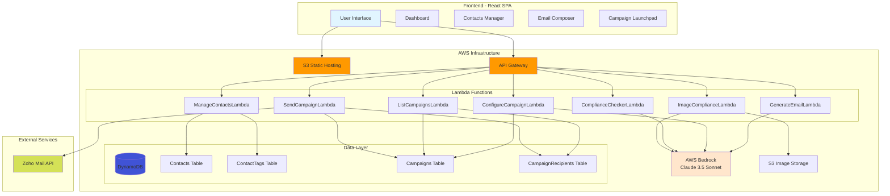
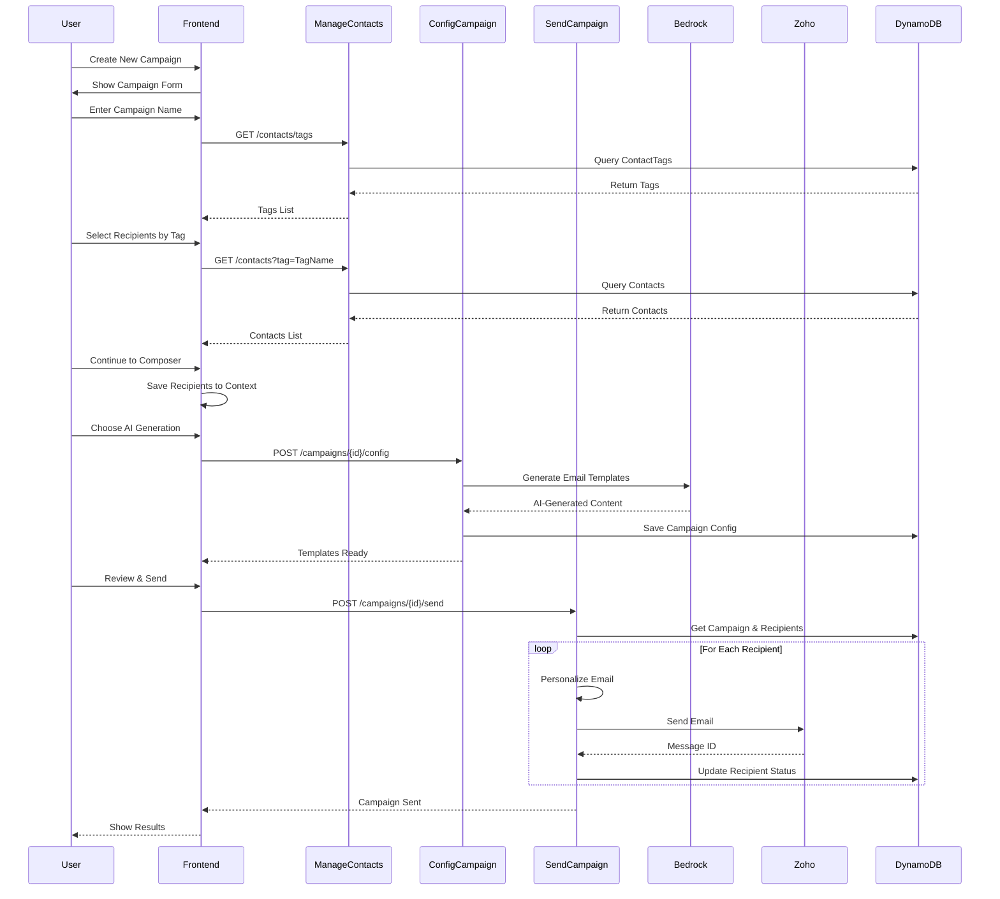

# Interon AI Email Agent 📧🤖

> **AI-Powered Email Campaign Management System** built with AWS Lambda, React, and Claude 3.5 Sonnet

[](https://aws.amazon.com)
[](https://reactjs.org)
[](https://python.org)

## 🚀 Overview

Interon AI Email Agent is a **serverless, AI-powered email campaign management system** that enables users to create, manage, and send personalized email campaigns at scale. Built on AWS infrastructure with Claude 3.5 Sonnet for AI-generated content.

### ✨ Key Features

- 🤖 **AI Email Generation** - Generate personalized email variations using Claude 3.5 Sonnet
- 👥 **Contact Management** - Full CRUD operations for contacts with tag-based organization
- 📊 **Campaign Dashboard** - Track campaign performance with real-time statistics
- ✍️ **Dual Composer Modes** - Manual writing or AI-powered generation
- 🎯 **Smart Recipient Selection** - Select recipients by tags or search
- 📈 **Real-time Analytics** - Monitor sent/failed emails and campaign status
- ✅ **Compliance Checking** - Built-in text and image compliance validation
- 🔄 **Automated Workflows** - Streamlined campaign creation to sending process

---

## 📐 Architecture

### System Overview



### Campaign Creation Workflow



---

## 🛠️ Tech Stack

### Frontend
- **Framework**: React 18.3 with TypeScript
- **Build Tool**: Vite
- **UI Components**: Custom components with Lucide icons
- **State Management**: React Context API
- **Styling**: Tailwind CSS
- **Hosting**: AWS S3 Static Website

### Backend
- **Runtime**: AWS Lambda (Python 3.9 & 3.11)
- **API**: AWS API Gateway / Lambda Function URLs
- **Database**: Amazon DynamoDB
- **AI/ML**: AWS Bedrock (Claude 3.5 Sonnet)
- **Email**: Zoho Mail API with OAuth 2.0
- **Storage**: Amazon S3

### Infrastructure
- **Region**: us-east-2 (Ohio)
- **IaC**: AWS CLI / PowerShell scripts
- **CI/CD**: Manual deployment via scripts

---

## 📦 Project Structure

```
Interon AI Email Agent/
├── src/                              # React Frontend Source
│   ├── components/
│   │   ├── campaign/
│   │   │   └── RecipientSelector.tsx    # NEW: Recipient selection
│   │   ├── contacts/
│   │   │   ├── ContactGrid.tsx          # NEW: Contact management
│   │   │   └── AddContactModal.tsx      # NEW: Add contact form
│   │   ├── ui/                          # Reusable UI components
│   │   ├── ComplianceChecker.tsx
│   │   ├── ImageUploader.tsx
│   │   └── Sidebar.tsx
│   ├── pages/
│   │   ├── Dashboard.tsx
│   │   ├── Contacts.tsx                 # NEW: Contacts page
│   │   ├── Import.tsx                   # UPDATED: New workflow
│   │   ├── Composer.tsx                 # UPDATED: Fixed state
│   │   └── Launchpad.tsx
│   ├── context/
│   │   └── CampaignContext.tsx          # UPDATED: Fixed async issues
│   ├── config/
│   │   └── api.js                       # API endpoints
│   └── App.tsx
│
├── lambda-functions/                 # AWS Lambda Backend
│   ├── ManageContactsLambda/            # NEW: Contact CRUD
│   │   ├── lambda_function.py
│   │   └── ManageContactsLambda.zip
│   ├── GenerateEmailLambda/
│   │   ├── generate_email.py
│   │   └── GenerateEmailLambda.zip
│   ├── ConfigureCampaignLambda/
│   │   ├── lambda_function.py
│   │   └── ConfigureCampaignLambda.zip
│   ├── ListCampaignsLambda/
│   │   ├── list_campaigns.py
│   │   └── ListCampaignsLambda.zip
│   ├── SendCampaignLambda/
│   │   ├── lambda_function.py
│   │   └── SendCampaignLambda.zip
│   ├── ComplianceCheckerLambda/
│   │   ├── lambda_function.py
│   │   └── ComplianceCheckerLambda.zip
│   └── ImageComplianceLambda/
│       ├── lambda_function.py
│       └── ImageComplianceLambda.zip
│
├── public/                           # Static assets
├── package.json
├── vite.config.ts
├── tsconfig.json
└── README.md
```

---

## 🚀 Getting Started

### Prerequisites

- Node.js 16+ (for frontend development)
- Python 3.9+ (for Lambda development)
- AWS CLI configured with credentials
- Access to AWS us-east-2 region

### Local Development

#### 1. Clone the Repository
```bash
git clone https://github.com/kamishas/Email-AI-Automation-Agent.git
cd Email-AI-Automation-Agent
```

#### 2. Install Frontend Dependencies
```bash
npm install
```

#### 3. Start Development Server
```bash
npm run dev
```

The application will be available at `http://localhost:5173`

#### 4. Build for Production
```bash
npm run build
```

### Deployment

#### Deploy Frontend to S3
```bash
# Build the application
npm run build

# Sync to S3 bucket
aws s3 sync build s3://interon-email-agent-frontend-kamin/ --delete --region us-east-2
```

#### Deploy Lambda Functions
```bash
# Example: Deploy ManageContactsLambda
cd lambda-functions/ManageContactsLambda
zip -r ManageContactsLambda.zip lambda_function.py
aws lambda update-function-code \
  --function-name ManageContactsLambda \
  --zip-file fileb://ManageContactsLambda.zip \
  --region us-east-2
```

---

## 📚 API Documentation

### Contact Management

#### Get All Tags
```http
GET /contacts/tags
```

**Response:**
```json
{
  "tags": [
    {"tag": "Clients", "count": 15},
    {"tag": "Prospects", "count": 8}
  ]
}
```

#### Get Contacts
```http
GET /contacts
GET /contacts?tag=Clients
```

**Response:**
```json
{
  "contacts": [
    {
      "contactId": "uuid",
      "firstName": "John",
      "lastName": "Doe",
      "email": "john@example.com",
      "company": "Acme Corp",
      "tags": ["Clients", "VIP"]
    }
  ]
}
```

#### Create Contact
```http
POST /contacts
Content-Type: application/json

{
  "firstName": "Jane",
  "lastName": "Smith",
  "email": "jane@example.com",
  "company": "Tech Inc",
  "tags": ["Prospects"]
}
```

### Campaign Operations

#### Generate Email Variations
```http
POST /generate-email
Content-Type: application/json

{
  "intent": "Cold outreach for job opportunities",
  "tone": "Professional",
  "count": 3
}
```

#### Configure Campaign
```http
POST /campaigns/{campaignId}/config
Content-Type: application/json

{
  "mode": "manual",
  "subject": "Job Opportunity",
  "bodyTemplate": "Hi {{firstName}}, we have an exciting opportunity..."
}
```

#### Send Campaign
```http
POST /campaigns/{campaignId}/send
```

### Compliance Checking

#### Check Text Compliance
```http
POST /compliance/check
Content-Type: application/json

{
  "text": "Email content to check..."
}
```

**Response:**
```json
{
  "isCompliant": true,
  "violations": [],
  "score": 95
}
```

---

## 🔐 Environment Variables

### ConfigureCampaignLambda
```bash
CAMPAIGNS_TABLE=Campaigns
MODEL_ID=us.anthropic.claude-3-5-sonnet-20241022-v2:0
MAX_TOKENS=1024
TEMPERATURE=0.4
```

### SendCampaignLambda
```bash
CAMPAIGNS_TABLE=Campaigns
RECIPIENTS_TABLE=CampaignRecipients
ZOHO_BASE_URL=https://mail.zoho.com
ZOHO_ACCOUNT_ID=your_account_id
SOURCE_EMAIL=your_email@domain.com
ZOHO_CLIENT_ID=your_client_id
ZOHO_CLIENT_SECRET=your_client_secret
ZOHO_REFRESH_TOKEN=your_refresh_token
```

### ManageContactsLambda
```bash
CONTACTS_TABLE=Contacts
CONTACT_TAGS_TABLE=ContactTags
```

---

## 🗄️ Database Schema

### Contacts Table
```
Primary Key: contactId (String)
Attributes:
  - firstName: String
  - lastName: String
  - email: String (Unique)
  - company: String
  - tags: List<String>
  - createdAt: String (ISO 8601)
```

### ContactTags Table
```
Primary Key: tag (String)
Attributes:
  - count: Number
  - lastUsed: String (ISO 8601)
```

### Campaigns Table
```
Primary Key: campaignId (String)
Attributes:
  - campaignName: String
  - status: String (draft | sending | completed)
  - mode: String (manual | auto)
  - subject: String
  - bodyTemplate: String
  - autoTemplates: String (JSON)
  - createdAt: String
```

### CampaignRecipients Table
```
Primary Key: campaignId (String)
Sort Key: recipientId (String)
Attributes:
  - email: String
  - firstName: String
  - lastName: String
  - status: String (pending | sent | failed)
  - zohoMessageId: String
  - errorMessage: String
```

---

## 🎯 Usage Examples

### Creating a Campaign

1. **Navigate to Dashboard** → Click "New Campaign"
2. **Enter Campaign Name** → e.g., "Q1 Outreach"
3. **Select Recipients**:
   - **By Label**: Choose a tag (e.g., "Prospects")
   - **By Search**: Search and multi-select contacts
4. **Continue to Composer**
5. **Choose Mode**:
   - **Manual**: Write your own email
   - **AI**: Let Claude generate variations
6. **Review & Send** → Monitor progress in Launchpad

### Managing Contacts

1. **Navigate to Contacts** page
2. **Add Contact**: Click "+ Add Contact"
3. **Assign Tags**: Organize contacts with tags
4. **Filter**: Use tag dropdown to filter contacts
5. **Search**: Find contacts by name or email

---

## 🐛 Known Issues & Roadmap

### Current Limitations
- No pagination for large contact lists
- Limited error retry logic for failed sends
- Zoho API rate limiting not implemented
- No A/B testing for email variations

### Planned Features
- 📅 Campaign scheduling
- 📊 Advanced analytics dashboard
- 🔄 Drip campaign support
- 📧 Email template library
- 🔗 CRM integrations (Salesforce, HubSpot)
- 📱 Mobile responsive design improvements

---

## 📄 License

Proprietary - Interon AI

---

## 👥 Contributors

**Maintained by**: Interon AI Team  
**AWS Region**: us-east-2 (Ohio)  
**Last Updated**: January 4, 2026

---

## 🆘 Support

For issues, questions, or feature requests, please contact the Interon AI team.

**Live Application**: https://interon-email-agent-frontend-kamin.s3.us-east-2.amazonaws.com/index.html